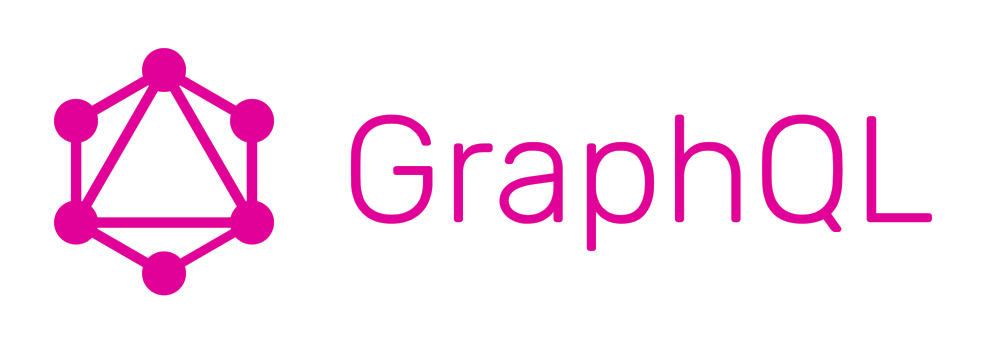

Graphql rest api.

# README

GraphQL on the server allows you to define how you want to fetch your data. Then, on the client, you can execute a query that has the exact data shape you want, and the data you get back will have the same shape as the query.

# REST vs Graphql

- Rest multiple endpoints to get the information vs Graphql only one endpoint for getting all the information at the same time.
- Rest return verbose json vs Graphql return specific information
- Rest schemaless you need Swagger vs Graphql schema based you don't need Swagger 

# Pieces of the puzzle

- define one endpoint
- define the entities and their relationship between them
- define the queries with a name and in/out paremeters using the entities. 


# SDL the schema definition language

Use the SDL to define the entities and the relationships between them. Something similar to the hibernate entities idea.

# Reference

- https://graphql.org
- https://graphql.org/graphql-js/running-an-express-graphql-server/
- https://medium.freecodecamp.org/graphql-front-end-queries-made-easy-68e9d9ded283

# video tutorial
- https://www.howtographql.com/basics/0-introduction/

## Run the server
```
node server.js
```

## Run graphiql console
Since we configured graphqlHTTP with graphiql: true, you can use the GraphiQL tool to manually issue GraphQL queries. If you navigate in a web browser to 
```
http://localhost:4000/graphql
```


## Testing server via curl

```
curl -X GET -i "http://localhost:4000/" -H "Content-type: application/json" -H "Accept: application/json"
```

# TIPS

## closing ports
```
sudo lsof -i :4000
sudo kill -9 PID
```

### Starting & Stopping express.js

- https://www.npmjs.com/package/@godaddy/terminus
